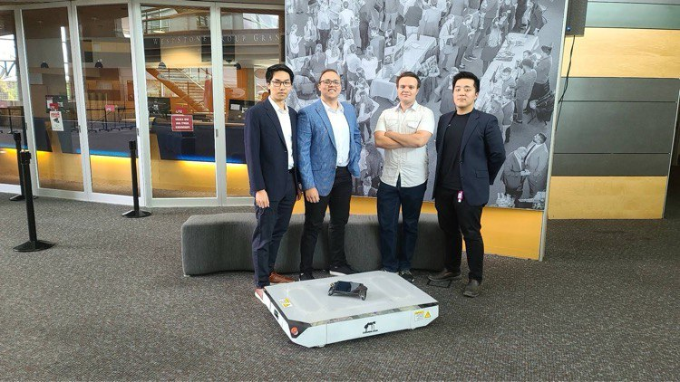
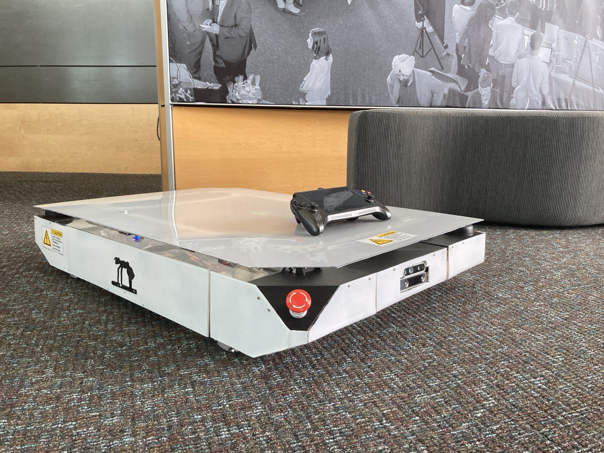

# ANTS Robotics
Capstone project for Simon Fraser University Summer 2021 cohort.\
Developed by the following guys:
- [Ibrahim Helal - Autonomy and Self-Driving](https://www.ihelal.com/pac)
- [Dmitrii Gusev - Embedded](https://www.linkedin.com/in/dmitriigusev/)
- [James Z Liu - Mechanical](https://www.linkedin.com/in/jameszliu/)
- [Nam Mai - Teleoperation](https://www.linkedin.com/in/nam-anh-mai/)

## Project Goal:
Develop state-of-the-art mobile robotics platfrom (AGV) targeting manufacturing businesses. Robot's electronic hardware must provide direct path for linear scalability from smaller systems all the way to the bigger robots. Same functionality modules can be stacked together on the ITX-style carrier board allowing to increase robot's capabilities.

## Repo structure:
Firmware:
- LED Controller
- Drive Control Unit (DCU)
- Power Control Unit (PCU)
